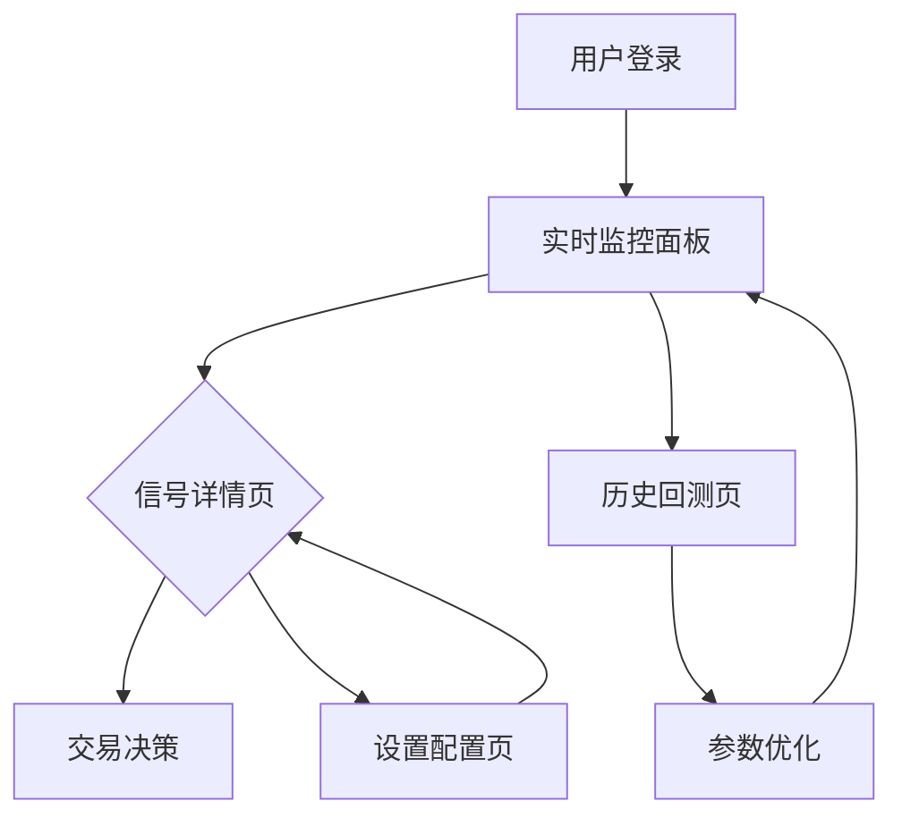

## 1. 产品概述
币安USDT-M合约底部雷达是一个专业的加密货币合约交易信号监控系统，基于Market Flow和Vix Fix算法，实时监控Binance USDT-M合约市场，捕捉由量价吸筹驱动并经过情绪过滤确认的底部买入机会。系统为交易者提供实时、准确的市场底部信号，帮助用户在最佳时机进入合约市场。

产品主要解决交易者无法及时识别市场底部、缺乏量化信号支持、情绪化交易等问题，通过算法驱动的信号系统，为用户提供客观、可量化的交易决策依据。

## 2. 核心功能

### 2.1 访问与权限
系统为公开访问，无需注册登录；所有功能以匿名模式使用，订阅与用户角色相关功能取消。

### 2.2 功能模块
系统包含以下核心页面：
1. **实时监控面板**：展示当前市场信号、热力图、实时价格
2. **信号详情页**：单个交易对的详细信号分析、图表展示
3. **历史回测页**：策略历史表现、收益统计、参数优化
4. **设置配置页**：算法参数调整、告警设置、个人偏好
5. （已取消）用户中心页：不再提供账户与订阅相关功能

### 2.3 页面详情
| 页面名称 | 模块名称 | 功能描述 |
|----------|----------|----------|
| 实时监控面板 | 信号概览区 | 显示当前活跃信号总数、强势信号数量、市场情绪指数 |
| 实时监控面板 | 热力图模块 | 以热力图形式展示所有USDT-M合约信号强度，支持时间筛选 |
| 实时监控面板 | 实时价格面板 | 显示前20名交易对价格、24h涨跌幅、成交量变化 |
| 实时监控面板 | 信号列表 | 按时间倒序列出最新触发的信号，包含置信度评分 |
| 信号详情页 | K线图表 | 集成TradingView图表，标注信号触发点位 |
| 信号详情页 | 指标分析 | 展示Market Flow、Vix Fix指标数值及变化趋势 |
| 信号详情页 | 信号评分 | 综合评分系统，包含趋势、量能、情绪三个维度 |
| 历史回测页 | 策略表现 | 展示策略历史收益率、胜率、最大回撤等关键指标 |
| 历史回测页 | 参数优化 | 允许用户调整算法参数并查看回测结果变化 |
| 设置配置页 | 算法参数 | 调整Market Flow和Vix Fix的敏感度和阈值 |
| 设置配置页 | 告警设置 | 设置信号推送方式、频率、过滤条件 |
| （取消）用户中心页 | — | 已移除认证与订阅相关功能 |

## 3. 核心流程

### 用户操作流程
1. **新用户流程**：访问首页 → 注册账户 → 查看示例信号 → 选择订阅套餐 → 开始使用
2. **日常监控流程**：登录系统 → 查看实时监控面板 → 点击感兴趣的信号 → 查看详细分析 → 做出交易决策
3. **策略优化流程**：进入历史回测页 → 选择时间范围 → 调整参数 → 运行回测 → 对比结果 → 保存配置

### 信号生成流程
数据采集 → 算法计算 → 信号过滤 → 置信度评分 → 实时推送 → 用户展示

## 4. 用户界面设计

### 4.1 设计风格
- **主色调**：深色主题，主色为#0A0E1A，辅色为#1A1F2E，强调色为#00D4AA
- **按钮风格**：圆角矩形，渐变背景，悬停动效
- **字体选择**：主要使用Inter字体，标题24-32px，正文14-16px
- **布局风格**：卡片式布局，网格系统，响应式设计
- **图标风格**：线性图标，统一使用React Icons库

### 4.2 页面设计概览
| 页面名称 | 模块名称 | UI元素 |
|----------|----------|--------|
| 实时监控面板 | 信号概览区 | 大号数字显示活跃信号，使用渐变色彩，添加脉冲动画效果 |
| 实时监控面板 | 热力图模块 | 10x10网格布局，颜色从绿到红表示信号强度，支持悬停详情 |
| 实时监控面板 | 实时价格面板 | 表格形式，价格变动使用绿色/红色高亮，添加闪烁动效 |
| 信号详情页 | K线图表 | 全屏TradingView组件，信号点用黄色星标，支持缩放和平移 |
| 信号详情页 | 指标分析 | 三线图展示Market Flow，面积图展示Vix Fix，使用半透明填充 |
| 历史回测页 | 策略表现 | 卡片式展示关键指标，收益率用绿色大字体，回撤用红色 |

### 4.3 响应式设计
- **桌面优先**：默认设计为1920x1080分辨率，支持多窗口布局
- **移动端适配**：支持768px以下屏幕，转为单列布局，触摸优化
- **平板适配**：768px-1200px范围，双列布局，支持横竖屏切换
