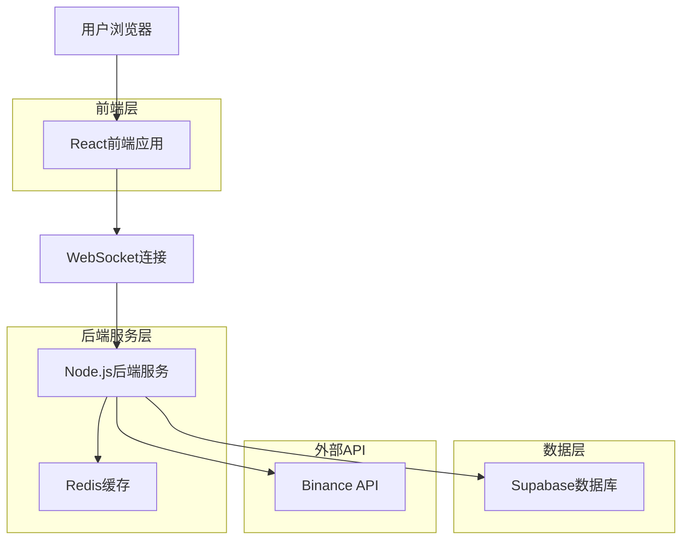
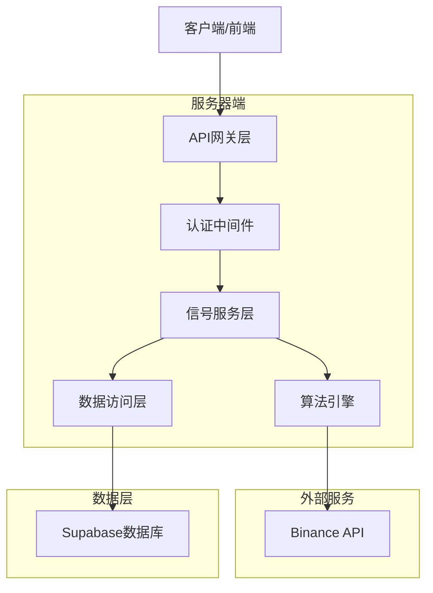
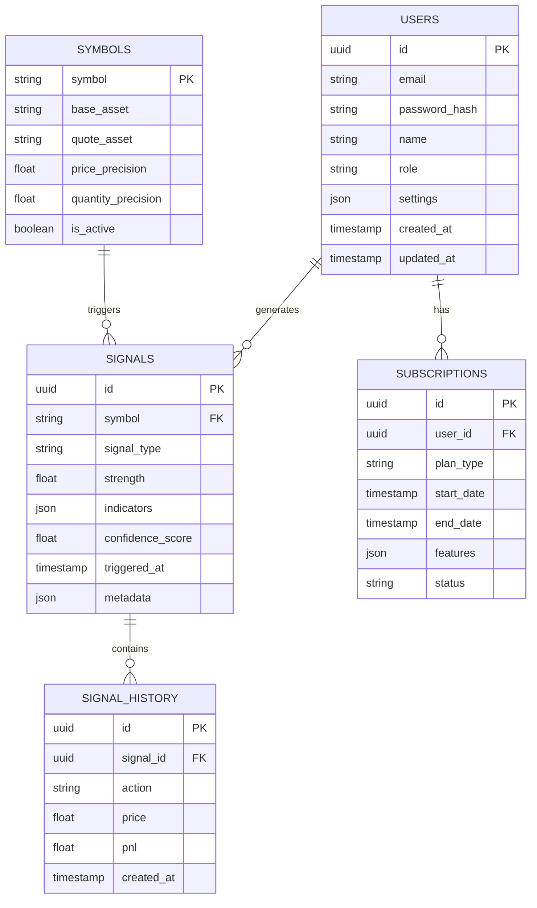

## 1. 架构设计



## 2. 技术描述

- **前端**: React@18 + TypeScript + TailwindCSS@3 + Vite
- **初始化工具**: vite-init
- **后端**: Node.js@18 + Express@4 + WebSocket
- **数据库**: Supabase (PostgreSQL)
- **缓存**: Redis@7
- **实时通信**: Socket.io
- **图表库**: TradingView Charting Library + Recharts
- **状态管理**: Zustand
- **UI组件**: HeadlessUI + RadixUI

## 3. 路由定义

| 路由 | 用途 |
|------|------|
| / | 实时监控面板，系统主页面 |
| /signal/:symbol | 信号详情页，展示特定交易对的详细分析 |
| /backtest | 历史回测页，策略回测和参数优化 |
| /settings | 设置配置页，算法参数和告警设置 |
| /profile | 用户中心页，账户信息和订阅管理 |
| /auth/login | 登录页面 |
| /auth/register | 注册页面 |

## 4. API定义

### 4.1 核心API

系统为公开API，不提供认证端点；所有读端公开，写端由服务端权限控制。

#### 信号获取API
```
GET /api/signals/realtime
```

请求参数:
| 参数名 | 参数类型 | 是否必需 | 描述 |
|--------|----------|----------|------|
| limit | number | false | 返回信号数量，默认50 |
| strength | string | false | 信号强度筛选：all/strong/medium/weak |

响应:
| 参数名 | 参数类型 | 描述 |
|--------|----------|------|
| signals | array | 信号列表 |
| total | number | 总信号数量 |
| lastUpdate | string | 最后更新时间 |

#### 历史数据API
```
GET /api/signals/history/:symbol
```

请求参数:
| 参数名 | 参数类型 | 是否必需 | 描述 |
|--------|----------|----------|------|
| startTime | number | true | 开始时间戳 |
| endTime | number | true | 结束时间戳 |
| interval | string | false | K线周期：1m/5m/15m/1h/4h/1d |

#### WebSocket事件
```
ws://api/signals/stream
```

事件类型:
- `signal.new` - 新信号生成
- `signal.update` - 信号状态更新
- `price.update` - 价格更新
- `market.status` - 市场状态变化

## 5. 服务器架构图



## 6. 数据模型

### 6.1 数据模型定义



### 6.2 数据定义语言

#### 用户表 (users)
```sql
-- 创建表
CREATE TABLE users (
    id UUID PRIMARY KEY DEFAULT gen_random_uuid(),
    email VARCHAR(255) UNIQUE NOT NULL,
    password_hash VARCHAR(255) NOT NULL,
    name VARCHAR(100) NOT NULL,
    role VARCHAR(20) DEFAULT 'user' CHECK (role IN ('user', 'premium', 'admin')),
    settings JSONB DEFAULT '{}',
    created_at TIMESTAMP WITH TIME ZONE DEFAULT NOW(),
    updated_at TIMESTAMP WITH TIME ZONE DEFAULT NOW()
);

-- 创建索引
CREATE INDEX idx_users_email ON users(email);
CREATE INDEX idx_users_role ON users(role);

-- 权限设置
GRANT SELECT ON users TO anon;
GRANT ALL PRIVILEGES ON users TO authenticated;
```

#### 信号表 (signals)
```sql
-- 创建表
CREATE TABLE signals (
    id UUID PRIMARY KEY DEFAULT gen_random_uuid(),
    symbol VARCHAR(20) NOT NULL,
    signal_type VARCHAR(20) NOT NULL CHECK (signal_type IN ('buy', 'sell', 'hold')),
    strength FLOAT NOT NULL CHECK (strength >= 0 AND strength <= 1),
    indicators JSONB NOT NULL,
    confidence_score FLOAT NOT NULL CHECK (confidence_score >= 0 AND confidence_score <= 1),
    triggered_at TIMESTAMP WITH TIME ZONE DEFAULT NOW(),
    metadata JSONB DEFAULT '{}',
    created_at TIMESTAMP WITH TIME ZONE DEFAULT NOW()
);

-- 创建索引
CREATE INDEX idx_signals_symbol ON signals(symbol);
CREATE INDEX idx_signals_triggered_at ON signals(triggered_at DESC);
CREATE INDEX idx_signals_strength ON signals(strength DESC);
CREATE INDEX idx_signals_type ON signals(signal_type);

-- 权限设置
GRANT SELECT ON signals TO anon;
GRANT ALL PRIVILEGES ON signals TO authenticated;
```

#### 订阅表 (subscriptions)
```sql
-- 创建表
CREATE TABLE subscriptions (
    id UUID PRIMARY KEY DEFAULT gen_random_uuid(),
    user_id UUID REFERENCES users(id) ON DELETE CASCADE,
    plan_type VARCHAR(20) NOT NULL CHECK (plan_type IN ('free', 'basic', 'premium', 'enterprise')),
    start_date TIMESTAMP WITH TIME ZONE DEFAULT NOW(),
    end_date TIMESTAMP WITH TIME ZONE,
    features JSONB DEFAULT '{}',
    status VARCHAR(20) DEFAULT 'active' CHECK (status IN ('active', 'expired', 'cancelled')),
    created_at TIMESTAMP WITH TIME ZONE DEFAULT NOW()
);

-- 创建索引
CREATE INDEX idx_subscriptions_user_id ON subscriptions(user_id);
CREATE INDEX idx_subscriptions_status ON subscriptions(status);
CREATE INDEX idx_subscriptions_end_date ON subscriptions(end_date);

-- 权限设置
GRANT SELECT ON subscriptions TO authenticated;
```

#### 交易对表 (symbols)
```sql
-- 创建表
CREATE TABLE symbols (
    symbol VARCHAR(20) PRIMARY KEY,
    base_asset VARCHAR(10) NOT NULL,
    quote_asset VARCHAR(10) NOT NULL,
    price_precision INTEGER NOT NULL,
    quantity_precision INTEGER NOT NULL,
    is_active BOOLEAN DEFAULT true,
    created_at TIMESTAMP WITH TIME ZONE DEFAULT NOW()
);

-- 创建索引
CREATE INDEX idx_symbols_active ON symbols(is_active);

-- 初始数据
INSERT INTO symbols (symbol, base_asset, quote_asset, price_precision, quantity_precision) VALUES
('BTCUSDT', 'BTC', 'USDT', 2, 6),
('ETHUSDT', 'ETH', 'USDT', 2, 5),
('ADAUSDT', 'ADA', 'USDT', 4, 0),
('DOTUSDT', 'DOT', 'USDT', 3, 1),
('LINKUSDT', 'LINK', 'USDT', 3, 1);

-- 权限设置
GRANT SELECT ON symbols TO anon;
GRANT ALL PRIVILEGES ON symbols TO authenticated;
```

### 6.3 算法参数配置

#### Market Flow算法参数表 (market_flow_params)
```sql
-- 创建表
CREATE TABLE market_flow_params (
    id UUID PRIMARY KEY DEFAULT gen_random_uuid(),
    user_id UUID REFERENCES users(id),
    volume_threshold FLOAT DEFAULT 1.5,
    price_change_threshold FLOAT DEFAULT 0.02,
    time_window INTEGER DEFAULT 24,
    smoothing_factor FLOAT DEFAULT 0.1,
    is_default BOOLEAN DEFAULT false,
    created_at TIMESTAMP WITH TIME ZONE DEFAULT NOW()
);
```

#### Vix Fix算法参数表 (vix_fix_params)
```sql
-- 创建表
CREATE TABLE vix_fix_params (
    id UUID PRIMARY KEY DEFAULT gen_random_uuid(),
    user_id UUID REFERENCES users(id),
    lookback_period INTEGER DEFAULT 22,
    bollinger_period INTEGER DEFAULT 20,
    bollinger_deviations FLOAT DEFAULT 2.0,
    smoothing_period INTEGER DEFAULT 3,
    is_default BOOLEAN DEFAULT false,
    created_at TIMESTAMP WITH TIME ZONE DEFAULT NOW()
);
```
